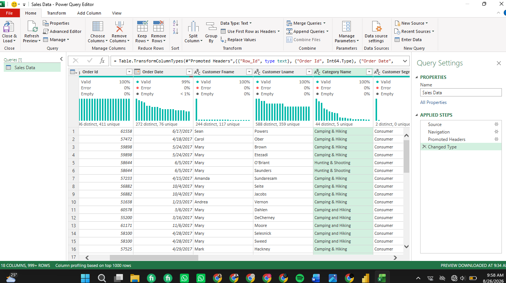
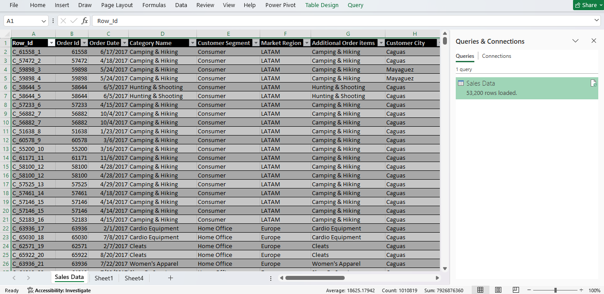
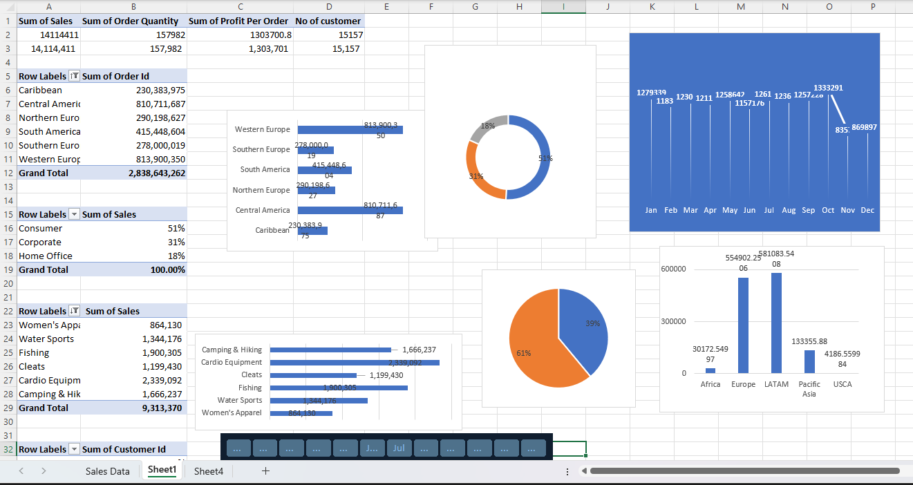
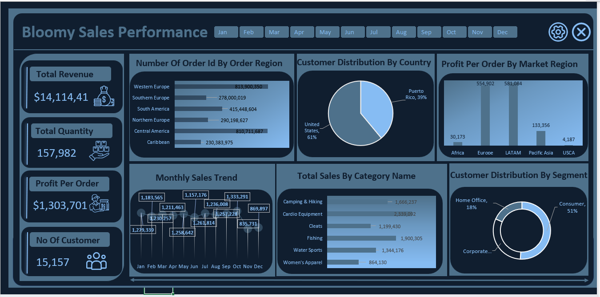

## 📈 Bloomy Sales Performance Dashboard (Excel)

This project is an Excel dashboard designed to give stakeholders a clear, centralized view of sales performance across regions, customer segments, product categories, and countries. Raw transactional order data is cleaned in Power Query, modeled with PivotTables, and visualized through a custom-styled interactive dashboard.

This project transforms raw sales order data into an interactive dashboard that helps stakeholders track core sales KPIs, identify top-performing regions and categories, and understand customer distribution.

## 📌 Project Overview

Sales teams generate large volumes of order-level data — covering order dates, categories, customer segments, market regions, and countries. Without a centralized way to view this data, spotting trends in regional performance and customer behavior is difficult.

This Excel report was developed to provide insight into:

- 📊 Key performance indicators — total revenue, order quantity, profit per order, and customer count
- 🌍 Regional trends — order volume by region and profit per order by market
- 🛒 Category performance — total sales by product category
- 👥 Customer insights — distribution by country and by customer segment
- 📅 Time trends — monthly sales patterns with month-by-month filtering

The report enables data-driven decision-making for sales strategy, regional focus, and customer targeting.

## 🎯 Business Problem

Stakeholders need clear answers to key questions:

- Which regions generate the most orders and the most profit per order?
- Which product categories drive the most sales?
- How is the customer base distributed by country and by segment?
- How does revenue trend across the months of the year?

Without a centralized dashboard, these insights stay buried across disconnected order records.

This dashboard solves the problem by consolidating raw sales order data into a single interactive Excel report.

## 📂 Dataset

- **Dataset Scope:** Multi-region sales order data (53,200 rows loaded)
- **Key Fields:** Order Id, Order Date, Customer First/Last Name, Category Name, Customer Segment, Market Region, Order Region, Country, Additional Order Items, Customer City

## 📈 Key Metrics and KPIs

- **Total Revenue** — $14,114,411
- **Total Quantity** — 157,982
- **Profit Per Order** — $1,303,701
- **No. of Customers** — 15,157

## 🧹 Data Cleaning & Preparation

- Imported raw order data into Power Query and reviewed column quality using built-in data profiling (Valid / Error / Empty indicators) for each field
- Promoted headers and corrected column data types (e.g., Order Id to integer, Order Date to date)
- Created a custom composite `Row_Id` field (Category prefix + Order Id + row number) to support unique row-level identification
- Loaded the cleaned query into a live Excel table for PivotTable analysis

## 🛠️ Build Process (Data Cleaning, Pivot Tables & Dashboard)

### Power Query Data Cleaning
Power Query Editor showing the raw "Sales Data" query with column quality profiling (Valid/Error/Empty) across fields like Order Id, Order Date, Customer Name, Category Name, and Customer Segment, along with the applied transformation steps (Promoted Headers, Changed Type).

### Loaded Data Table
The cleaned query loaded into an Excel worksheet, showing 53,200 rows with fields including Row_Id, Order Id, Order Date, Category Name, Customer Segment, Market Region, Additional Order Items, and Customer City — confirmed via the Queries & Connections panel.

### PivotTables & PivotCharts (Build Stage)
Working area showing the PivotTables and PivotCharts built from the loaded data — including the summary KPI pivot, order volume by region, sales by customer segment, sales by category, and profit per order by market region — along with a month slicer used to drive all visuals.

### Final Dashboard
The completed "Bloomy Sales Performance" dashboard showing KPI cards (Total Revenue, Total Quantity, Profit Per Order, No. of Customers) alongside visuals for order volume by region, customer distribution by country, profit per order by market region, monthly sales trend, total sales by category, and customer distribution by segment — with month-based filter buttons across the top.

## 📊 Dashboard Structure

### Page 1 — Overview
🎯 **Purpose:** "Where are we selling, to whom, and how much are we making?"

📌 **KPIs:**
- Total Revenue
- Total Quantity
- Profit Per Order
- No. of Customers

📊 **Visuals:**
- Bar chart — Number of Orders by Order Region
- Pie chart — Customer Distribution by Country
- Bar chart — Profit Per Order by Market Region
- Line chart — Monthly Sales Trend
- Bar chart — Total Sales by Category Name
- Donut chart — Customer Distribution by Segment
- Month filter buttons (Jan–Dec) driving all visuals

## 💡 Key Insights & Business Question Analysis

**Which regions generate the most orders and the most profit per order?**
Western Europe and Central America lead in order volume, but LATAM and Europe generate the highest profit per order — Pacific Asia, Africa, and USCA lag far behind.

**Which product categories drive the most sales?**
Cardio Equipment leads sales, followed by Fishing and Camping & Hiking. Women's Apparel is the weakest category.

**How is the customer base distributed by country and segment?**
Customers are mostly US-based (61%) vs. Puerto Rico (39%). By segment, Consumer leads at 51%, followed by Corporate (31%) and Home Office (18%).

**What does the monthly sales trend show?**
Sales stay fairly steady (~$1.15M–$1.33M) from Jan–Oct, peak in July, then drop sharply in Nov–Dec — worth investigating further.

## 🚀 Strategic Recommendations

📍 **Prioritize High-Volume Regions**
Use the order-volume-by-region breakdown to focus sales resources on regions like Western Europe and Central America.

📊 **Tailor Marketing to Customer Segment Mix**
With Consumer customers making up over half the base, align promotions and messaging toward that segment while maintaining Corporate and Home Office relationships.

🛒 **Double Down on Top Categories**
Use the category breakdown (Cardio Equipment, Camping & Hiking, Water Sports) to guide inventory and merchandising priorities.

## 🔚 Conclusion

This dashboard transforms raw sales order data into a strategic tool for understanding regional performance and customer behavior. Instead of digging through raw transaction records, stakeholders can now see clearly where sales are strongest, who is buying, and how performance trends over time — enabling smarter regional, category, and customer-focused decisions.

## ✨ Key Dashboard Features

- ✅ KPI cards for revenue, quantity, profit per order, and customer count
- ✅ Regional breakdown of order volume and profitability
- ✅ Category-level sales breakdown
- ✅ Customer distribution by country and segment
- ✅ Month-by-month filtering across all visuals
- ✅ Custom-styled dashboard layout built on top of native Excel PivotCharts

## 🛠️ Tools and Skills

- Microsoft Excel
- Power Query
- PivotTables & PivotCharts
- Data cleaning & transformation
- Dashboard design
- Data visualization
